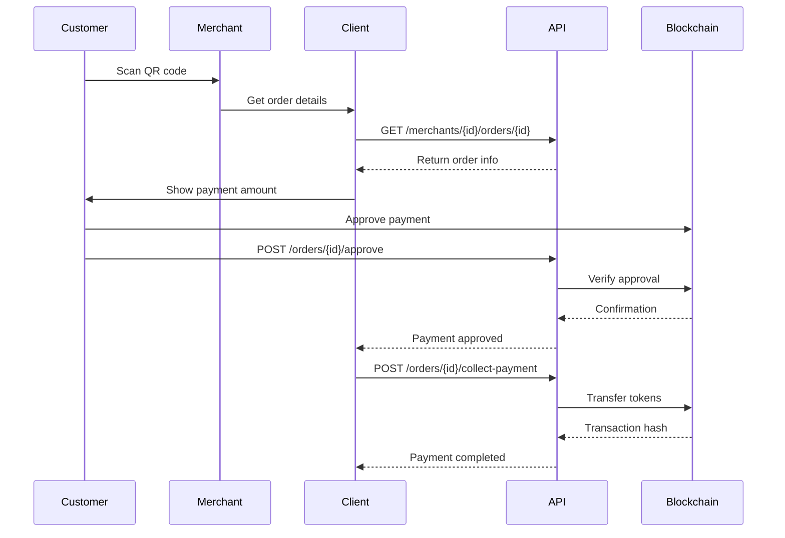
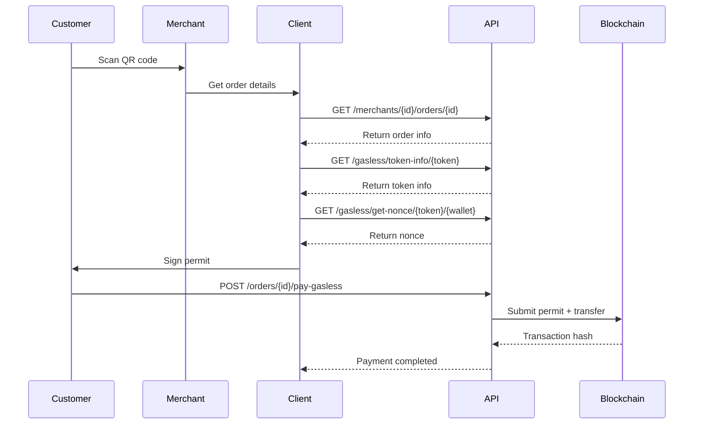
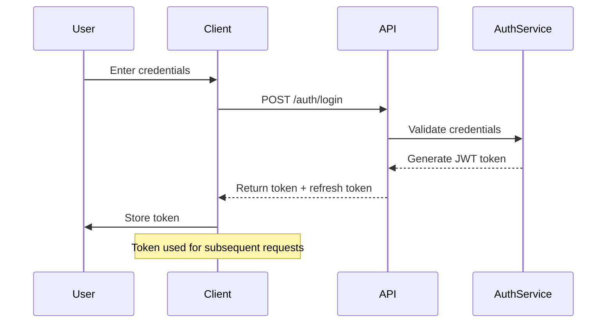
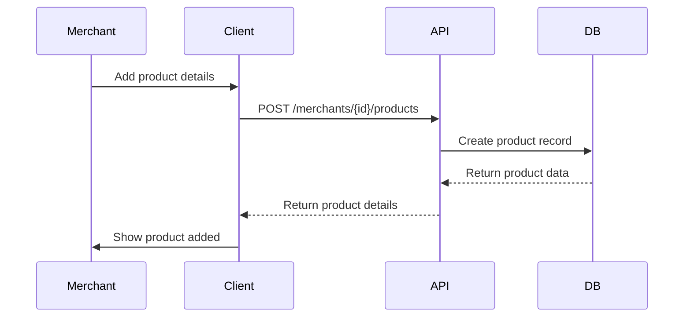
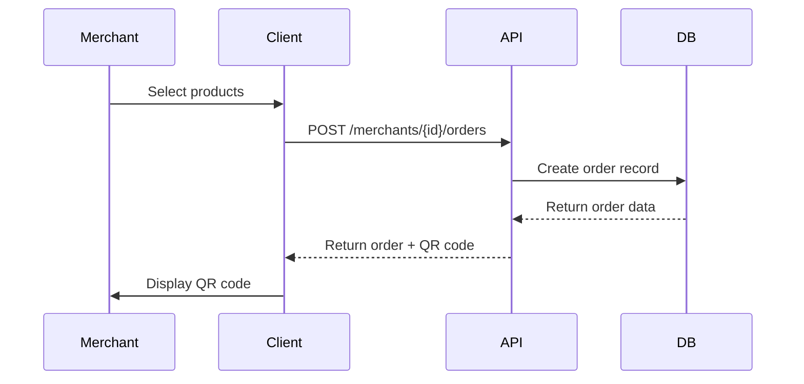
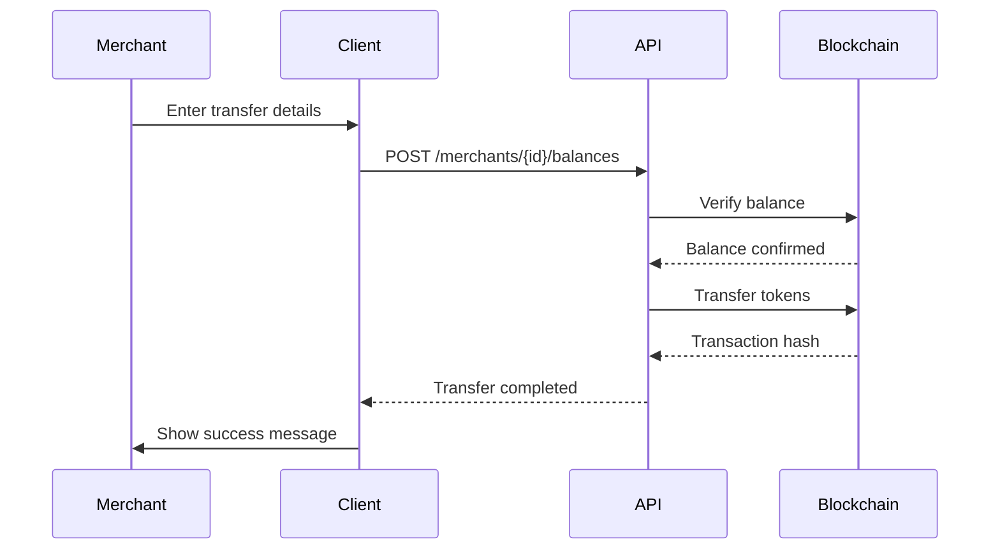
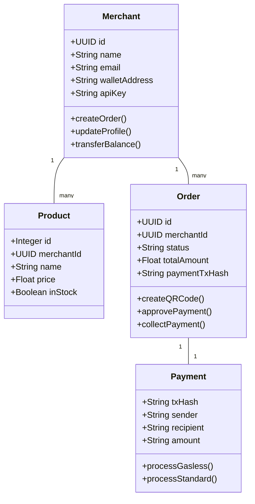
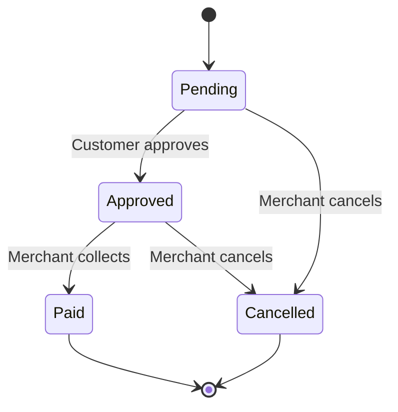
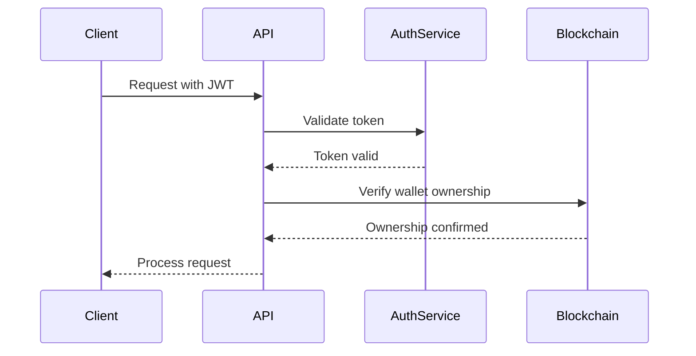
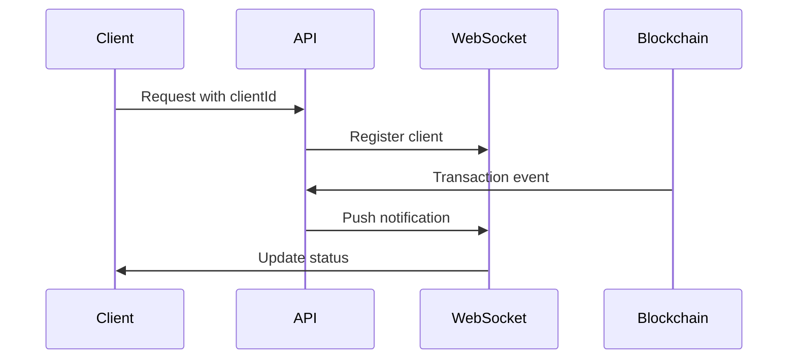

# TahiPay System Workflows

  
## Common Payment Flow

  

## Gasless Payment Flow

  

## Authentication Flow

  

  

  

## Product Management Flow

  

  

## Order Creation Flow

  

  

  

## Balance Transfer Flow

  

  

## System Components

  

  

## State Transitions

  

  

## Security Flow

  

  

## WebSocket Notifications

  

